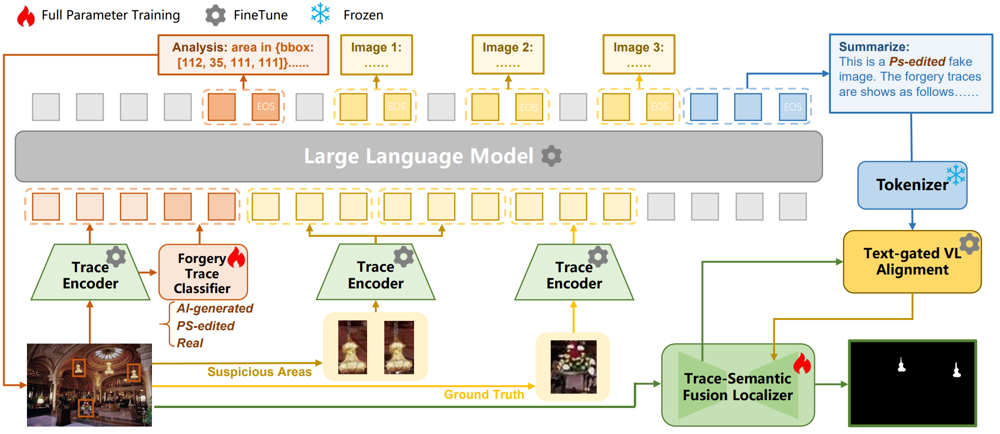
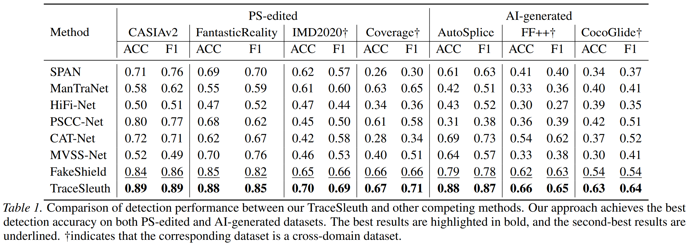
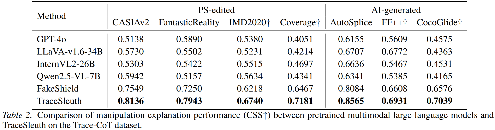
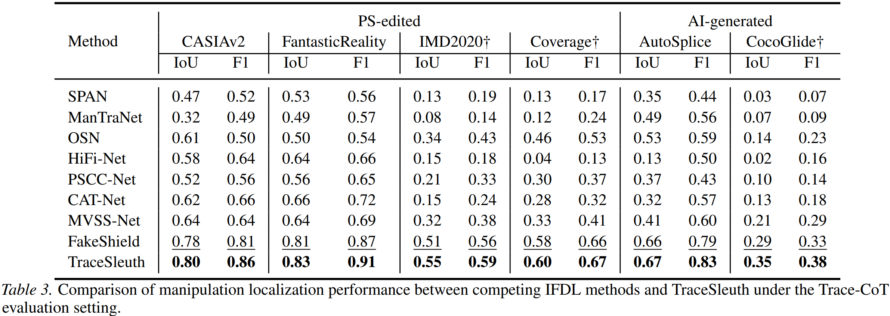
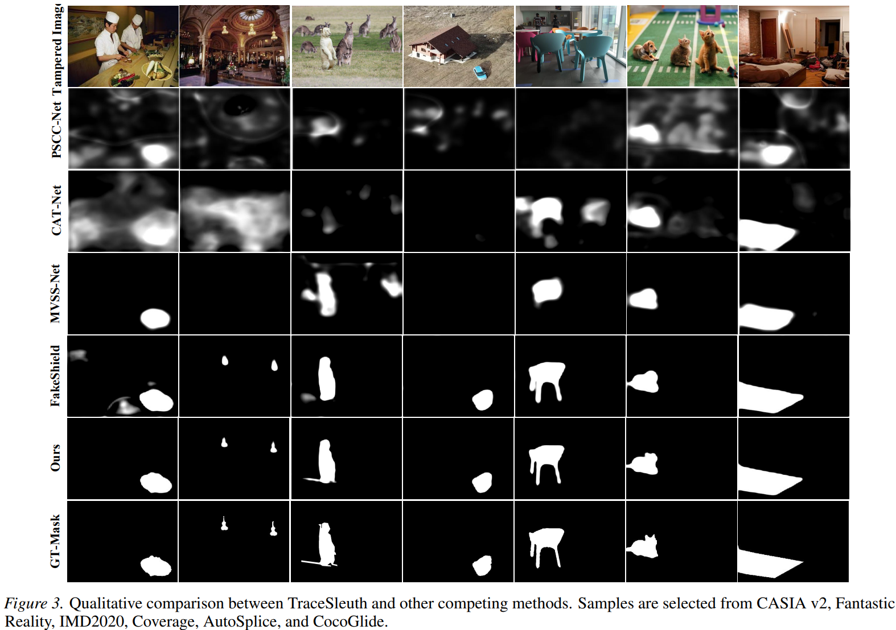

# TraceSleuth

This is the official code for TraceSleuth: Coarse-to-Fine Hierarchical Reasoning with Trace Amplification for Precise Image Forgery Analysis.

The rapid advancement of generative AI has significantly reduced the cost of content creation while simultaneously enabling more accessible and harder-to-detect image manipulations, posing new challenges to trustworthy media and forensic analysis. Existing multimodal forgery detectors typically rely on single-stage fusion with one-shot generation, offering limited intermediate evidence and often producing fine-grained explanations that are weakly grounded or logically inconsistent.

To address these limitations, we propose **TraceSleuth**, a coarse-to-fine, three-stage, evidence-driven reasoning framework for joint forgery detection and explanation. TraceSleuth first performs global recognition to establish a testable hypothesis space, then amplifies local forensic traces through frequency-domain enhancement and integrates them with high-level semantic features via evidence-gated fusion. Finally, an LLM is constrained by the accumulated evidence to generate pixel-level localization and faithful rationales, reducing misalignment between textual explanations and visual cues.



## Setup

```bash
conda create -n traceSleuth python=3.11 
conda activate traceSleuth
bash setup.sh
```

## Training

You can run the following bash file to reproduce the model.

```bash
bash sft_7b.sh
```

## Main Result







